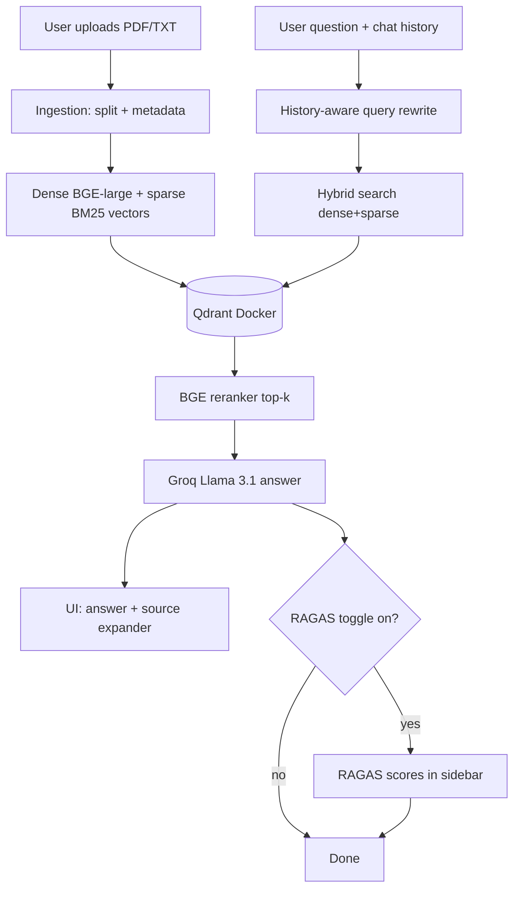

# SSA using RAG

A document Q&A chatbot powered by **Retrieval-Augmented Generation (RAG)**. Upload PDF or TXT files, ask questions, and get answers grounded in your documents—with source citations, conversational follow-ups, and optional quality scoring.

## Features

| Feature | Description |
|---------|-------------|
| **Qdrant vector store** | Persistent hybrid-indexed storage via Docker (replaces in-memory FAISS) |
| **Persistent corpus + auto-connect** | Indexed documents survive restarts; the app auto-connects on load so a curated corpus is queryable without re-uploading |
| **Admin seed script** | `scripts/seed_corpus.py` bulk-indexes a folder of papers additively (idempotent, skips already-indexed files) |
| **BGE-large embeddings** | Dense semantic vectors (`BAAI/bge-large-en-v1.5`) |
| **Hybrid search** | Combines dense (BGE) + sparse (BM25) retrieval in Qdrant |
| **Reranking** | Cross-encoder reranker (`BAAI/bge-reranker-v2-m3`) refines top results |
| **Source citations** | Expandable source panel with filename, page, and snippet |
| **Conversation history** | History-aware query rewriting for follow-up questions |
| **RAGAS evaluation** | Optional faithfulness and answer-relevancy scores (sidebar toggle) |

## Architecture



## Project Structure

```
SCA-using-RAG/
├── README.md
├── requirements.txt
├── docker-compose.yml        # Local Qdrant
├── .env.example
├── prompts/
│   └── rag_system.txt        # System + contextualize prompts
├── data/
│   └── corpus/               # Drop PDFs/TXTs here for the seed script
├── scripts/
│   └── seed_corpus.py        # Admin: bulk-index data/corpus into Qdrant
├── frontend/
│   └── app.py                # Streamlit UI
└── backend/
    ├── config.py             # Models, retrieval knobs, env vars
    ├── embeddings.py         # BGE-large + FastEmbed sparse
    ├── ingestion.py          # Document loading and chunking
    ├── vectorstore.py        # Qdrant hybrid indexing (additive upsert)
    ├── retrieval.py          # Hybrid retriever + reranker
    ├── rag_chain.py          # History-aware RAG chain
    └── evaluation/
        └── ragas_eval.py     # RAGAS metrics
```

## Prerequisites

- Python 3.10+
- Docker and Docker Compose
- [Groq API key](https://console.groq.com/)

## Quick Start

1. **Clone the repository**

   ```bash
   git clone <your-repo-url>
   cd "SCA using RAG"
   ```

2. **Create a virtual environment and install dependencies**

   ```bash
   python -m venv .venv
   source .venv/bin/activate   # Windows: .venv\Scripts\activate
   pip install -r requirements.txt
   ```

3. **Configure environment variables**

   ```bash
   cp .env.example .env
   # Edit .env and set GROQ_API_KEY
   ```

4. **Start Qdrant**

   ```bash
   docker compose up -d
   ```

   Qdrant dashboard: http://localhost:6333/dashboard

5. **(Optional) Seed a curated corpus**

   Drop PDF/TXT files into `data/corpus/`, then index them once:

   ```bash
   python -m scripts.seed_corpus            # index new files in data/corpus
   python -m scripts.seed_corpus --dir path/to/papers
   python -m scripts.seed_corpus --force    # re-index even if already present
   ```

   Seeding is additive and idempotent: already-indexed files are skipped, and
   re-running never duplicates content. The app will auto-connect to whatever is
   indexed, so users can query the corpus without uploading anything.

6. **Run the app**

   ```bash
   streamlit run frontend/app.py
   ```

7. **Use the app**

   - Enter your Groq API key in the sidebar (or set `GROQ_API_KEY` in `.env`)
   - If documents are already indexed (e.g. via the seed script), the app
     **auto-connects** on load — just start asking questions
   - To add more documents: upload PDF/TXT files and click **Process Documents
     and Start Chat**. New documents are added alongside the existing ones
   - Ask questions; expand **Sources** under each answer
   - Optionally enable **RAGAS evaluation** for quality scores

## Configuration

Environment variables (see `.env.example`):

| Variable | Default | Description |
|----------|---------|-------------|
| `GROQ_API_KEY` | — | Groq API key for LLM and RAGAS judge |
| `QDRANT_URL` | `http://localhost:6333` | Qdrant server URL |
| `QDRANT_COLLECTION` | `rag_documents` | Collection name |
| `GROQ_MODEL` | `llama-3.1-8b-instant` | Groq model ID |
| `RETRIEVE_K` | `20` | Chunks retrieved before reranking |
| `FINAL_K` | `5` | Chunks sent to LLM after reranking |

Tune chunking and models in `backend/config.py`.

## How Each Enhancement Works

**Qdrant (vs FAISS)** — Vectors persist in Docker; collections support named dense and sparse vectors for hybrid search.

**BGE-large** — Stronger semantic embeddings than BGE-small; ~1.3 GB download on first run (CPU).

**Hybrid search** — Dense vectors capture meaning; BM25 sparse vectors match keywords. Qdrant fuses both via reciprocal rank fusion (RRF).

**Reranking** — Retrieves 20 candidates, then the BGE cross-encoder reranker picks the top 5 most relevant chunks for the LLM.

**Source citations** — Each chunk stores filename, page, and preview text; the UI shows deduplicated sources per answer.

**Conversation history** — Follow-ups like “tell me more about that” are rewritten into standalone questions before retrieval.

**RAGAS** — When enabled, each answer is scored for faithfulness (grounded in context) and answer relevancy (matches the question).

## Limitations

- First run downloads embedding and reranker models (several GB total).
- Embedding and reranking on CPU can be slow for large documents.
- Processing documents adds to the Qdrant collection (previous index is preserved). To rebuild from scratch, drop the collection via the Qdrant dashboard or `reset_collection()`.
- RAGAS adds ~3–8 seconds per query when enabled.

## Tech Stack

- **UI:** Streamlit
- **LLM:** Groq (Llama 3.1)
- **Vector DB:** Qdrant
- **Embeddings:** BGE-large (dense), FastEmbed BM25 (sparse)
- **Reranker:** BGE-reranker-v2-m3
- **Framework:** LangChain
- **Evaluation:** RAGAS

## License

MIT (adjust as needed for your repository).
