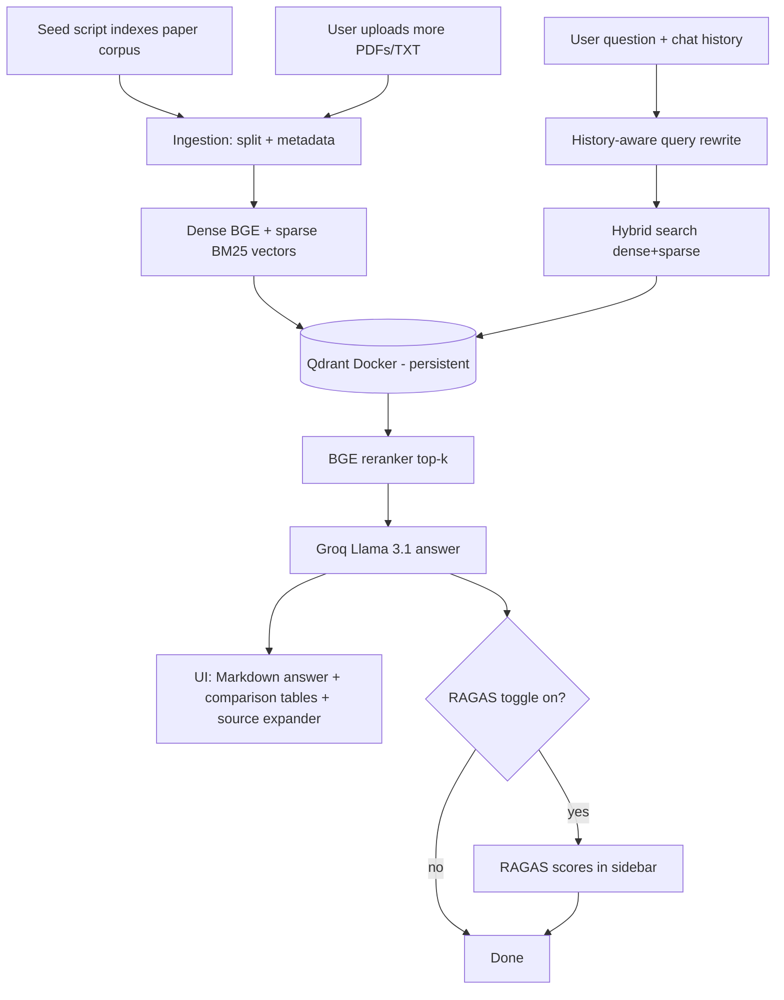

# AI Research Paper RAG Agent

A **Retrieval-Augmented Generation (RAG)** agent for querying AI/ML research papers. Ships with a curated corpus of landmark papers (Transformers, BERT, GPT-3, ResNet, GANs, diffusion, CLIP, RL, and more) and answers questions with grounded, paper-attributed explanations — including side-by-side **comparison tables** when several papers are relevant. Drop in your own PDFs to extend it.

## Features

| Feature | Description |
|---------|-------------|
| **Curated paper corpus** | Ships queryable out of the box; seed a folder of landmark AI papers once and query them forever |
| **Domain-tuned answers** | Prompt specialized for research papers: attributes claims to the source paper, explains concepts in depth, and **tabulates differences** across papers |
| **Rich Markdown rendering** | Answers render real tables, headings, lists, and code in the chat UI |
| **Qdrant vector store** | Persistent hybrid-indexed storage via Docker (replaces in-memory FAISS) |
| **Persistent corpus + auto-connect** | Indexed documents survive restarts; the app auto-connects on load so the corpus is queryable without re-uploading |
| **Admin seed script** | `scripts/seed_corpus.py` bulk-indexes a folder of papers additively (idempotent, skips already-indexed files) |
| **BGE embeddings** | Dense semantic vectors (`BAAI/bge-small-en-v1.5`) |
| **Hybrid search** | Combines dense (BGE) + sparse (BM25) retrieval in Qdrant |
| **Reranking** | Cross-encoder reranker (`BAAI/bge-reranker-base`) refines top results |
| **Source citations** | Expandable source panel with filename, page, and snippet |
| **Conversation history** | History-aware query rewriting for follow-up questions |
| **RAGAS evaluation** | Optional faithfulness and answer-relevancy scores (sidebar toggle) |

## Architecture



## Project Structure

```
SCA-using-RAG/
├── README.md
├── requirements.txt
├── docker-compose.yml        # Local Qdrant
├── .env.example
├── prompts/
│   └── rag_system.txt        # System + contextualize prompts
├── data/
│   └── corpus/               # Drop PDFs/TXTs here for the seed script
├── scripts/
│   └── seed_corpus.py        # Admin: bulk-index data/corpus into Qdrant
├── frontend/
│   └── app.py                # Streamlit UI
└── backend/
    ├── config.py             # Models, retrieval knobs, env vars
    ├── embeddings.py         # BGE dense + FastEmbed sparse
    ├── ingestion.py          # Document loading and chunking
    ├── vectorstore.py        # Qdrant hybrid indexing (additive upsert)
    ├── retrieval.py          # Hybrid retriever + reranker
    ├── rag_chain.py          # History-aware RAG chain
    └── evaluation/
        └── ragas_eval.py     # RAGAS metrics
```

## Prerequisites

- Python 3.10+
- Docker and Docker Compose
- [Groq API key](https://console.groq.com/)

## Quick Start

1. **Clone the repository**

   ```bash
   git clone <your-repo-url>
   cd AI-Research-Paper-RAG-Agent
   ```

2. **Create a virtual environment and install dependencies**

   ```bash
   python -m venv .venv
   source .venv/bin/activate   # Windows: .venv\Scripts\activate
   pip install -r requirements.txt
   ```

3. **Configure environment variables**

   ```bash
   cp .env.example .env
   # Edit .env and set GROQ_API_KEY
   ```

4. **Start Qdrant**

   ```bash
   docker compose up -d
   ```

   Qdrant dashboard: http://localhost:6333/dashboard

5. **Seed the paper corpus**

   Drop PDF/TXT files into `data/corpus/` (or point `--dir` at any folder), then
   index them once:

   ```bash
   python -m scripts.seed_corpus                      # index new files in data/corpus
   python -m scripts.seed_corpus --dir path/to/papers # index another folder
   python -m scripts.seed_corpus --force              # re-index even if already present
   ```

   Seeding is additive and idempotent: already-indexed files are skipped, and
   re-running never duplicates content. The app auto-connects to whatever is
   indexed, so you can query the corpus without uploading anything.

   > **Bulk seeding tip:** embedding many papers at once can exhaust GPU (Apple
   > MPS) memory. For large batches, force CPU embedding:
   > `EMBEDDING_DEVICE=cpu python -m scripts.seed_corpus`.

6. **Run the app**

   ```bash
   streamlit run frontend/app.py
   ```

7. **Use the app**

   - Enter your Groq API key in the sidebar (or set `GROQ_API_KEY` in `.env`)
   - If documents are already indexed (e.g. via the seed script), the app
     **auto-connects** on load — just start asking questions
   - To add more documents: upload PDF/TXT files and click **Process Documents
     and Start Chat**. New documents are added alongside the existing ones
   - Ask questions; expand **Sources** under each answer
   - Optionally enable **RAGAS evaluation** for quality scores

## Configuration

Environment variables (see `.env.example`):

| Variable | Default | Description |
|----------|---------|-------------|
| `GROQ_API_KEY` | — | Groq API key for LLM and RAGAS judge |
| `QDRANT_URL` | `http://localhost:6333` | Qdrant server URL |
| `QDRANT_COLLECTION` | `rag_documents` | Collection name |
| `GROQ_MODEL` | `llama-3.1-8b-instant` | Groq model ID |
| `RETRIEVE_K` | `8` | Chunks retrieved before reranking |
| `FINAL_K` | `5` | Chunks sent to LLM after reranking |
| `CORPUS_DIR` | `data/corpus` | Folder the seed script indexes by default |
| `EMBEDDING_DEVICE` | auto (MPS/CUDA/CPU) | Override embedding device (e.g. `cpu`) |

Tune chunking and models in `backend/config.py`.

## How Each Enhancement Works

**Qdrant (vs FAISS)** — Vectors persist in Docker; collections support named dense and sparse vectors for hybrid search.

**BGE embeddings** — `BAAI/bge-small-en-v1.5` dense (384-dim) semantic vectors; small and fast, downloaded on first run.

**Hybrid search** — Dense vectors capture meaning; BM25 sparse vectors match keywords. Qdrant fuses both via reciprocal rank fusion (RRF).

**Reranking** — Retrieves `RETRIEVE_K` (8) candidates, then the `BAAI/bge-reranker-base` cross-encoder picks the top `FINAL_K` (5) most relevant chunks for the LLM.

**Domain prompt + Markdown answers** — The system prompt (`prompts/rag_system.txt`) tailors answers to research papers: it attributes claims to the source paper, explains concepts in depth, and produces comparison tables when multiple papers are relevant. The chat UI renders that Markdown (tables, headings, lists, code).

**Source citations** — Each chunk stores filename, page, and preview text; the UI shows deduplicated sources per answer.

**Conversation history** — Follow-ups like “tell me more about that” are rewritten into standalone questions before retrieval.

**RAGAS** — When enabled, each answer is scored for faithfulness (grounded in context) and answer relevancy (matches the question).

## Limitations

- First run downloads embedding and reranker models.
- Embedding and reranking on CPU can be slow for large documents; bulk seeding on Apple MPS can hit GPU memory limits (use `EMBEDDING_DEVICE=cpu`).
- Processing documents adds to the Qdrant collection (previous index is preserved). To rebuild from scratch, drop the collection via the Qdrant dashboard or `reset_collection()`.
- Chat history is not truncated, so very long sessions can approach the model's context limit (handled gracefully with a friendly error).
- RAGAS adds ~3–8 seconds per query when enabled.

## Tech Stack

- **UI:** Streamlit
- **LLM:** Groq (Llama 3.1)
- **Vector DB:** Qdrant
- **Embeddings:** BGE-small-en-v1.5 (dense), FastEmbed BM25 (sparse)
- **Reranker:** BGE-reranker-base
- **Framework:** LangChain
- **Evaluation:** RAGAS

## License

MIT (adjust as needed for your repository).
